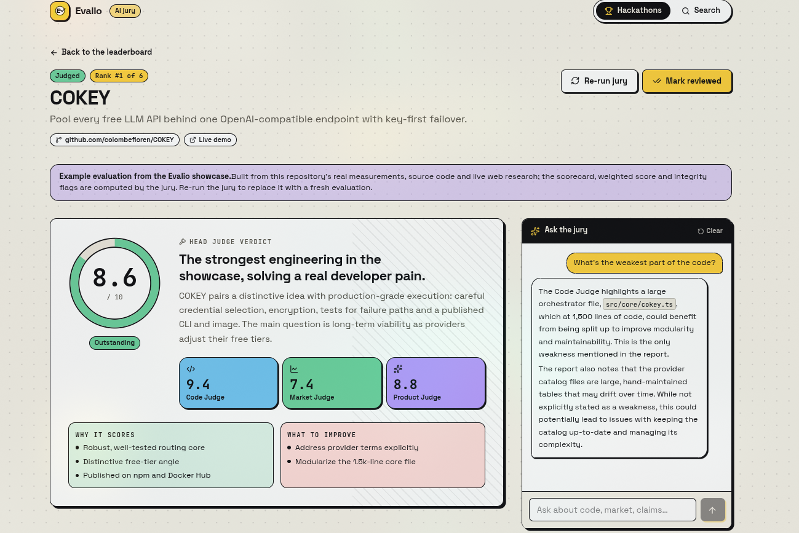

<div align="center">
  
  <h1>Evalio</h1>
  <p><b>The AI hackathon jury</b> — organiser console, live leaderboard and evidence-backed project reports.</p>
  <p>
    
    
    
    
    
    
  </p>
  <sub>Backend: <a href="https://github.com/0nlyDevs/EVALIO--BACKEND">EVALIO--BACKEND</a> (FastAPI · PostgreSQL · ChromaDB)</sub>
</div>

---

<p align="center">
  
</p>

## What you get

| Screen | Highlights |
|---|---|
| **Landing** `/` | What the jury checks, how it works — animated hero verdict, scroll reveals |
| **Console** `/dashboard` | Hackathons with phase, submissions, judged %, top score · create with **weighted criteria** routed to judges |
| **Hackathon** `/hackathon/[id]` | Criteria-weight bar · animated **podium** · ranked table (per-judge scores, criteria sparkline, flags) · filterable submissions · open/close submissions |
| **Report** `/project/[id]` | Score dial & head-judge verdict · live **pipeline tracker** while judging · scorecard with rationale + file evidence · Code / Market / Product reports · integrity flags · chat with the jury (cites files) · re-run, review, delete |
| **Search** `/search` | Semantic search across all submissions with match % |

Data refreshes automatically while evaluations run (`POLLING_INTERVAL_MS`) and stops once the jury is done.

## Design

Elevated neo-brutalism: warm paper background, 2px ink borders, hard offset shadows, Space Grotesk + JetBrains Mono.
One color per judge — <kbd>Code</kbd> sky · <kbd>Market</kbd> mint · <kbd>Product</kbd> violet. Motion via `motion/react`
(springs, staggered reveals, count-ups) and fully disabled under `prefers-reduced-motion`. Tokens live in `src/app/globals.css`.

## Quick start

```bash
cp .env.example .env.local     # NEXT_PUBLIC_API_URL=http://localhost:8000/api
npm install
npm run dev                    # http://localhost:3000
```

## Structure

```
src/app/                 routes (landing, dashboard, hackathon/[id], project/[id], search)
src/components/          Topbar, cards, modals, Leaderboard, PipelineTracker, ChatInterface
src/components/report/   scorecard + Code / Market / Product judge panels
src/components/ui/       shadcn primitives (select, calendar…)
src/lib/api.ts           typed API client
src/lib/hooks/           TanStack Query hooks (polling, mutations, chat, search)
```
